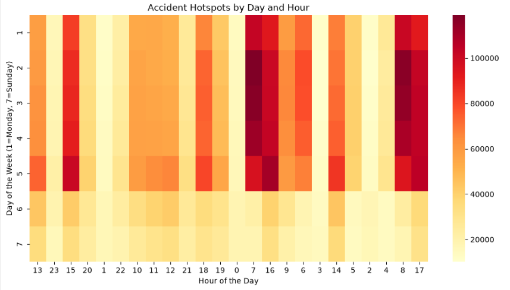

# 🚦 US Traffic Accident Analysis: Big Data Insights (7.7M+ Records)

### 📌 Project Overview
An end-to-end Exploratory Data Analysis (EDA) project focusing on over **7.7 million traffic accident records** across the United States. This project demonstrates high-performance data processing techniques to uncover temporal risk patterns and rush-hour accident hotspots.

---

### 🚀 Why This Project?
* **Scalable Processing:** Utilized `Polars` to handle a massive 7.7M+ row dataset, showcasing memory-efficient computing compared to traditional Pandas-based workflows.
* **Data Integrity:** Performed rigorous data cleaning, including spatial imputation for missing coordinates and temporal feature extraction.
* **Business Value:** Identified clear risk windows, providing data-backed insights for traffic safety planning.

---

### 📊 Key Business Insights
* **Rush-Hour Hotspots:** Accident density spikes significantly during standard morning (07:00–09:00) and evening (16:00–18:00) commutes.
* **Temporal Patterns:** Weekend traffic shows a marked reduction in accident frequency compared to high-stress weekdays.

---

### 🛠 Tech Stack
* **Language:** Python
* **Data Processing:** Polars
* **Visualization:** Seaborn, Matplotlib
* **Environment:** Jupyter Lab / Google Colab

---

### 📈 Accident Hotspot Visualization

---
*Built with professional rigor for scalable data analysis.*
